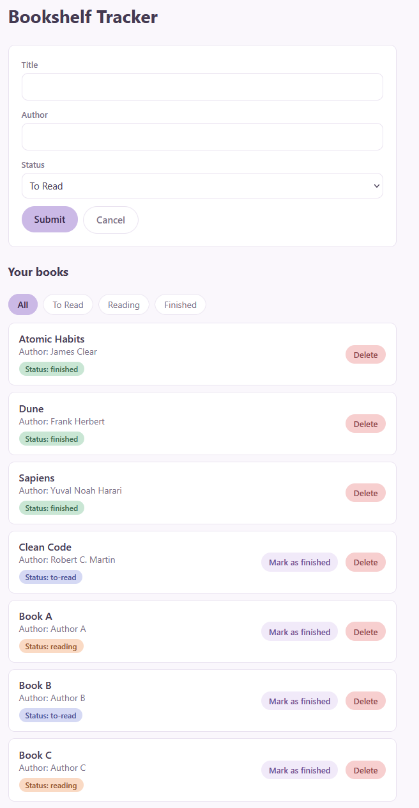

# Bookshelf Tracker

React app for logging books you are reading, have finished, or want to read. The book list is stored in a local json-server API, with add, delete, and status updates going over HTTP.

Built for the assignment **Lists, Asynchronous Programming, and Side Effects**.

## Features

- **Book list:** fetched from json-server when the app mounts. Each card shows the title, author, and a status badge. An empty list shows "No books yet. Add one below!"
- **Loading and error states:** a "Loading books..." message replaces the list while the fetch runs. A failed request shows an error message. Errors from add, delete, and update actions would be displayed above the list.
- **Add books:** a form with title, author, and a status select (to-read/reading/finished). A POST is performed to add a book. Cancel clears and closes the form.
- **Delete books:** each card has a Delete button with a confirmation prompt. The book is removed after the server confirms.
- **Per-card delete state:** only the book being deleted shows a "Deleting..." label. The other cards are unaffected.
- **Mark as finished:** a PATCH request updates just the status field. The button is hidden once a book is already finished.
- **Status filter:** All / To Read / Reading / Finished. The filtered list is derived from the books array and the selected filter.
- **Status styling:** each badge is coloured by reading status.
